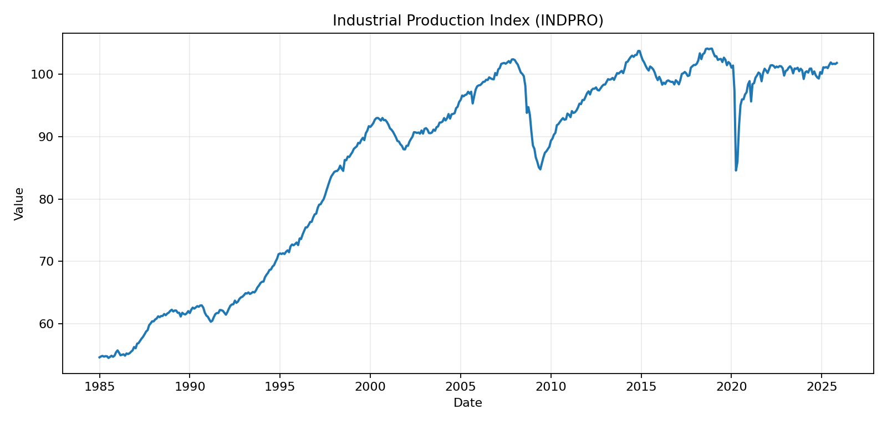
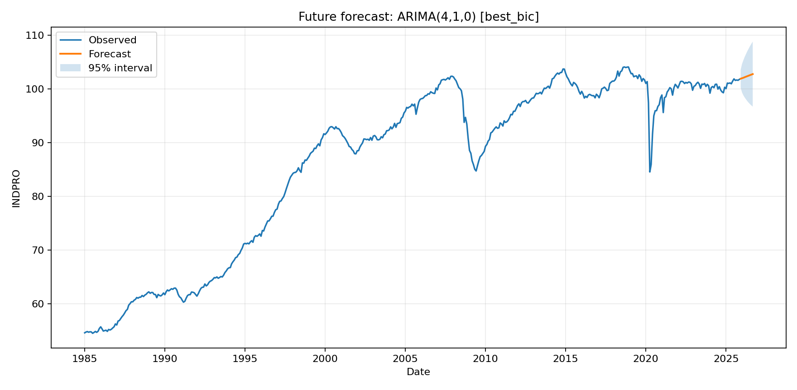

# Industrial Production Forecasting with ARIMA

This project analyzes the monthly U.S. Industrial Production Index (`INDPRO`) and builds a reproducible ARIMA forecasting pipeline. It started as coursework and is now packaged as a portfolio-ready Python project with a command-line workflow, saved model artifacts, and lightweight tests.

## What the Project Shows

- Time-series cleaning and chronological train/test splitting.
- First-order differencing and Augmented Dickey-Fuller stationarity testing.
- ACF/PACF diagnostics for model identification.
- ARMA grid search on the differenced series using AIC, BIC, and HQIC.
- ARIMA candidate evaluation with RMSE, MAE, MAPE, Theil's U2, and residual diagnostics.
- Future forecasting with 95 percent confidence intervals.

## Dataset

The included `INDPRO.csv` file contains monthly FRED Industrial Production Index observations from January 1985 through November 2025.

Columns:

- `observation_date`: monthly timestamp
- `INDPRO`: industrial production index value

## Project Structure

```text
.
|-- app.py              # Main ARIMA analysis pipeline and CLI
|-- fix.py              # Optional CSV normalization helper
|-- INDPRO.csv          # Input dataset
|-- requirements.txt    # Runtime dependencies
|-- tests/              # Lightweight regression tests
`-- README.md
```

Generated artifacts are written to `reports/`:

- `reports/tables/ic_grid_search.csv`
- `reports/tables/model_comparison.csv`
- `reports/tables/future_forecast.csv`
- `reports/figures/*.png`

## Results Snapshot

The current dataset run produced the following headline results:

- Date range: January 1985 to November 2025
- Train/test split: 392 train observations and 99 test observations
- ADF test on first difference: statistic `-5.8802`, p-value `3.092e-07`
- Best test-set model by RMSE: `ARIMA(4,1,0) [best_bic]`
- Best-model test metrics: RMSE `5.7159`, MAE `4.9294`, MAPE `4.9795%`
- Best-model Ljung-Box p-value at lag 10: `0.5768`

The Jarque-Bera p-value is close to zero, which is expected for this macroeconomic series because large crisis-period shocks create non-Gaussian residual tails. The residual autocorrelation check is the more important white-noise diagnostic for the selected ARIMA dynamics.





## Quickstart

```powershell
python -m venv .venv
.\.venv\Scripts\Activate.ps1
pip install -r requirements.txt
python app.py --data INDPRO.csv --output-dir reports
```

On macOS/Linux:

```bash
python3 -m venv .venv
source .venv/bin/activate
pip install -r requirements.txt
python app.py --data INDPRO.csv --output-dir reports
```

## Example Output

After running the pipeline, the console prints:

```text
ARIMA analysis complete
Dataset: INDPRO, 1985-01-01 to 2025-11-01
Train observations: 392 | Test observations: 99
ADF on first difference: statistic=-5.8802, p=3.092e-07
Best model by test RMSE: ARIMA(4,1,0) [best_bic] (RMSE=5.7159)
Artifacts saved to: <project>\reports
```

The final model is selected by test-set RMSE and then refit on the full sample to produce the future forecast.

## Testing

```powershell
python -m unittest discover -s tests
```

The tests cover data loading, chronological splitting, descriptive statistics, and forecast metric calculations.

## Notes

The accompanying coursework document was used as the methodological reference for this repository: stationarity analysis, ARIMA identification, residual diagnostics, and forecast evaluation. The code is the source of truth for the current `INDPRO` dataset and regenerates the final results from scratch.
